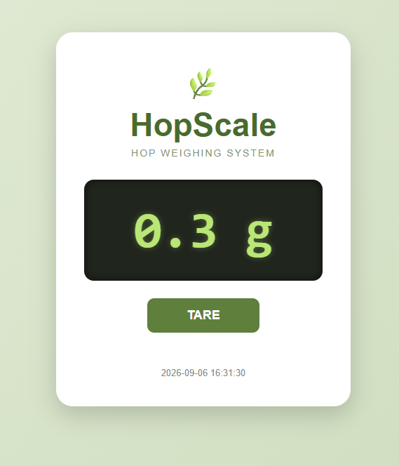

# HopScale 🌿⚖️

HopScale is a Raspberry Pi based digital scale designed for weighing hops during homebrewing.

The project uses a **1 kg load cell** connected through an **HX711 ADC** to a Raspberry Pi. Weight measurements are filtered and calibrated in Python and made available through a simple Flask-based web interface.

The scale currently provides a resolution of **0.1 g**, making it suitable for measuring hop additions during brewing.

## Web Interface

The current HopScale web interface displays the measured weight in real time and provides a remote **TARE** function.



The interface can be opened from computers, tablets, or mobile phones connected to the same network as the Raspberry Pi.

## Features

* 1 kg load cell
* HX711 24-bit ADC
* Direct HX711 communication using RPi.GPIO
* 0.1 g displayed resolution
* Multiple-sample averaging
* Minimum and maximum sample rejection
* Automatic tare at startup
* Remote TARE from the web interface
* JSON status output
* Flask web server
* Live weight updates using JavaScript
* Responsive web interface for desktop and mobile devices

## Hardware

The current hardware consists of:

* Raspberry Pi
* HX711 load cell amplifier / ADC
* 1 kg load cell

### GPIO Connections

| HX711 | Raspberry Pi             |
| ----- | ------------------------ |
| DT    | GPIO 21                  |
| SCK   | GPIO 26                  |
| VCC   | Appropriate HX711 supply |
| GND   | GND                      |

The software uses BCM GPIO numbering.

```python
DATA_PIN = 21
CLOCK_PIN = 26
```

## Calibration

HopScale is currently calibrated using ten Swedish 1-krona coins from 1973.

Each coin weighs approximately 7 g, giving a total reference weight of:

```text
10 × 7 g = 70 g
```

The current calibration factor is:

```python
CALIBRATION_FACTOR = 1063.1
```

Calibration tests produced approximately:

| Reference weight | HopScale |
| ---------------: | -------: |
|              7 g |    7.1 g |
|             35 g |   35.1 g |
|             70 g |   70.0 g |

## Measurement Filtering

To improve stability, HopScale takes multiple HX711 measurements for every displayed weight.

The measurement process is:

1. Read 10 raw HX711 samples.
2. Sort the samples.
3. Remove the lowest sample.
4. Remove the highest sample.
5. Calculate the mean of the remaining samples.
6. Subtract the tare offset.
7. Apply the calibration factor.
8. Display the result in grams.

Small variations close to zero are automatically displayed as `0.0 g`.

## Project Structure

```text
HopScale/
├── docs/
│   └── images/
│       └── hopscale_web.png
├── web/
│   ├── app.py
│   ├── static/
│   │   ├── script.js
│   │   └── style.css
│   └── templates/
│       └── index.html
├── control.json
├── hopscale.json
├── hopscale.py
├── requirements.txt
└── README.md
```

## Software Architecture

HopScale separates the scale process from the web server.

```text
1 kg Load Cell
      │
      ▼
    HX711
      │
      ▼
 hopscale.py
      │
      ├──────────────► hopscale.json
      │                     │
      │                     ▼
      │                  Flask
      │                     │
      │                     ▼
      │                Web Interface
      │                     │
      │                  TARE
      │                     │
      ◄──── control.json ◄──┘
```

`hopscale.py` is responsible for communicating with the HX711, filtering measurements, calculating weight, handling tare commands, and updating the JSON status file.

The Flask application reads the JSON status and provides it to the browser.

## JSON Status

The current weight is continuously written to:

```text
hopscale.json
```

Example:

```json
{
    "weight_g": 70.0,
    "timestamp": "2026-09-06 09:27:15"
}
```

The Flask web server exposes this information through:

```text
/api/status
```

The browser periodically reads this endpoint and updates the displayed weight without reloading the page.

## Remote Tare

The web interface includes a **TARE** button.

When the button is pressed:

1. JavaScript sends a POST request to Flask.
2. Flask writes a tare request to `control.json`.
3. `hopscale.py` detects the request.
4. A new tare offset is calculated.
5. `control.json` is reset.
6. The displayed weight returns to approximately `0.0 g`.

Example control file:

```json
{
    "tare": false
}
```

## Installation

Clone the repository and enter the project directory:

```bash
git clone <repository-url>
cd HopScale
```

Create a Python virtual environment:

```bash
python3 -m venv myenv
```

Activate it:

```bash
source myenv/bin/activate
```

Install the required Python packages:

```bash
pip install -r requirements.txt
```

## Running HopScale

HopScale consists of two processes.

### 1. Start the scale

From the project directory:

```bash
source myenv/bin/activate
python hopscale.py
```

The scale initializes the HX711 and automatically performs a tare operation during startup.

Make sure the scale is unloaded during startup.

A typical terminal output looks like:

```text
==============================
          HopScale
==============================

Initierar HX711...
Väntar på stabilisering...

Se till att vågen är TOM.

Tarerar vågen...
Tare offset: 25448.8
Tarering klar.

HopScale är redo.
```

### 2. Start the web server

Open another terminal:

```bash
cd web
python app.py
```

The Flask server listens on port:

```text
5000
```

Open a browser and navigate to the Raspberry Pi IP address followed by port 5000.

For example:

```text
http://192.168.1.100:5000
```

Replace the example IP address with the actual IP address of your Raspberry Pi.

## Requirements

The Python dependencies are stored in:

```text
requirements.txt
```

They can be recreated from the working virtual environment with:

```bash
pip freeze > requirements.txt
```

The project uses RPi.GPIO for direct communication with the HX711 instead of an external HX711 Python library.

## Notes

HopScale is designed primarily for weighing hops for homebrewing.

The current combination of a 1 kg load cell, HX711, sample filtering, and calibration provides stable measurements around the range typically used for hop additions.

Displayed resolution is 0.1 g. Actual accuracy depends on the load cell, HX711 module, mechanical construction, temperature, electrical noise, and calibration.

## Future Ideas

Possible future improvements include:

* Calibration from the web interface
* Configurable calibration factor
* Improved stability detection
* Automatic service startup using systemd
* Brewing recipe integration
* Hop addition presets
* Additional hardware documentation and wiring diagrams

## License

This project is intended for personal and educational use. Add a license file if you plan to distribute or reuse the project under a specific open-source license.
